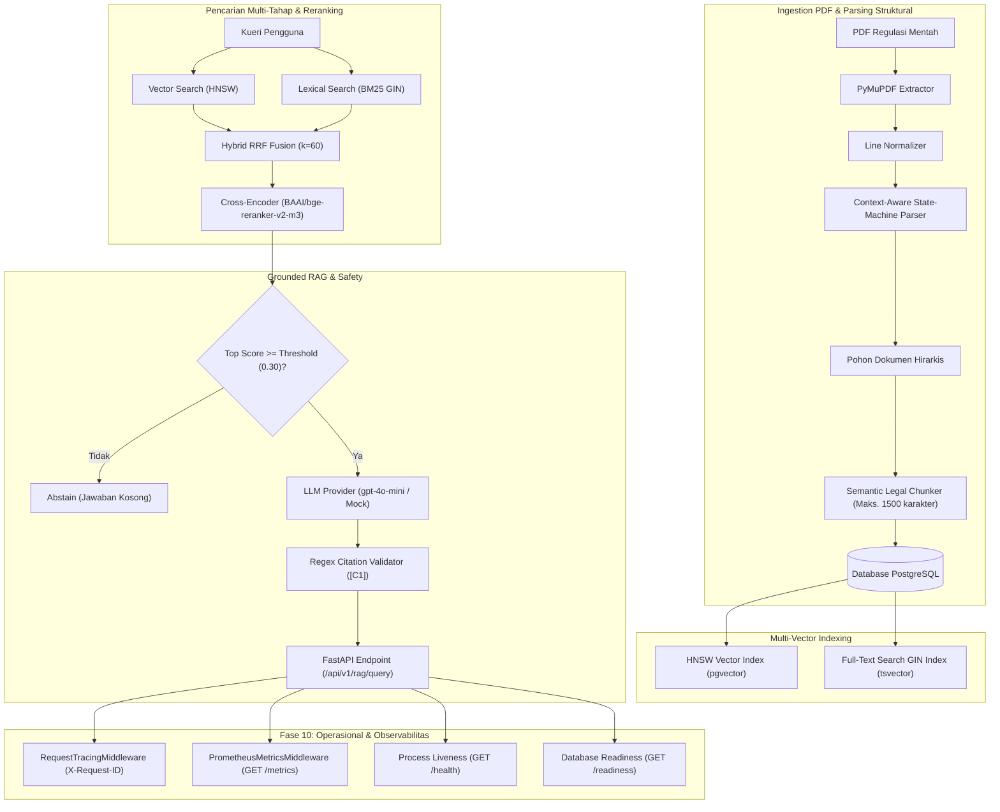

# FinReg Intelligence RAG: Platform RAG Peraturan Keuangan Indonesia Tingkat Enterprise

**Bahasa:** 🇮🇩 Bahasa Indonesia · [🇬🇧 English](README.md)

[](https://www.python.org/downloads/)
[](https://github.com/pgvector/pgvector)
[](https://fastapi.tiangolo.com/)
[](https://github.com/astral-sh/ruff)
[](Dockerfile)
[](LICENSE)

Platform Retrieval-Augmented Generation (RAG) berorientasi produksi tingkat enterprise yang dirancang khusus untuk peraturan keuangan Indonesia yang kompleks yang diterbitkan oleh **Bank Indonesia (BI)** dan **Otoritas Jasa Keuangan (OJK)**.

Sistem ini menggabungkan **parsing hirarki hukum berbasis state-machine**, **pencarian hibrida vector HNSW + lexical BM25**, **neural cross-encoder reranking**, **grounded generation dengan validasi sitasi yang ketat**, serta **fondasi operasional yang dikontainerisasi dan divalidasi melalui CI**.

---

## 🌟 Keunggulan Rekayasa Sistem

1. **Context-Aware State-Machine Structural Parser**:
   - Parser hukum kustom bergaya AST yang memproses struktur peraturan Indonesia yang kompleks (`BAB`, `Pasal`, `Ayat`, `Huruf`, `Angka`) menjadi pohon hirarkis eksplisit tanpa latency parsing oleh LLM pihak ketiga.
2. **Multi-Stage Hybrid Search (RRF $k=60$)**:
   - Menggabungkan dense vector embedding 1536 dimensi (indeks `pgvector` HNSW) dan full-text search BM25 bahasa Indonesia (indeks `tsvector` GIN) melalui Reciprocal Rank Fusion, dengan tetap mempertahankan pencarian pasal hukum secara exact maupun semantic paraphrase.
3. **Neural Cross-Encoder Reranking**:
   - Mengintegrasikan `BAAI/bge-reranker-v2-m3` melalui HuggingFace CrossEncoder untuk menilai presisi kandidat sebelum perakitan konteks LLM.
4. **Deterministic Grounding & Abstention Safeguards**:
   - Menggantikan pendekatan LLM-as-a-judge yang non-deterministik dengan parsing sitasi regex deterministik (`[C1]`), pengelolaan anggaran token, pencegahan kebocoran konteks, pertahanan terhadap prompt injection, penanganan konflik hukum, dan abstention awal berbasis ambang skor.
5. **Fondasi Operasional & Kontainer Produksi**:
   - `Dockerfile` multi-stage non-root (`python:3.11-slim`, `appuser` UID 10001), `docker-compose.yml` multi-container, workflow CI GitHub Actions, metrik Prometheus (`GET /metrics`), request tracing (`X-Request-ID`), serta pemeriksaan process `/health` dan database `/readiness` yang backward-compatible.
6. **Benchmark Evaluasi yang Dapat Diaudit**:
   - Engine evaluasi kustom yang mendukung MRR@K, HitRate@K, graded nDCG@K, Precision/Recall, Citation Validity, dan Abstention Accuracy dengan normalisasi canonical path pada lapisan evaluasi.

---

## 🏛 Arsitektur Sistem & Aliran Data



Diagram arsitektur detail, sequence flowchart, dan state machine didokumentasikan di [docs/architecture.id.md](docs/architecture.id.md).

---

## 📊 Hasil Benchmark Evaluasi Empiris Fase 8

Sistem memiliki engine evaluasi matematis kustom yang dijalankan melalui `python -m finreg.evaluation.cli`.

> **Catatan tentang Lingkungan Pengujian & Kapabilitas**:
> - **Kapabilitas Produksi**: `OpenAIEmbeddingProvider` (`text-embedding-3-small`), `CrossEncoderRerankerProvider` (`BAAI/bge-reranker-v2-m3`), `OpenAILLMProvider` (`gpt-4o-mini`).
> - **Fallback Benchmark Offline**: `MockEmbeddingProvider` (vector pseudo-random deterministik yang di-seed dengan hash) dan `MockLLMProvider` (stub pengujian offline).

### Metrik Retrieval (Populasi In-Domain: $N=2$)

| Metrik | Stage 1: Dense Vector (Phase 4A) [Non-production Mock] | Stage 2: BM25 Lexical (Phase 4B) | Stage 3: Hybrid RRF (Phase 4C) | Stage 4: Hybrid + Neural Reranker (Phase 5) |
| :--- | :---: | :---: | :---: | :---: |
| **MRR@1 / HitRate@1** | 0.0000 | 0.5000 | 0.0000 | 0.5000 |
| **MRR@5 / HitRate@5** | 0.0000 | **0.5000** | 0.2500 | **0.5000** |
| **nDCG@5** | 0.0000 | **0.1687** | 0.1064 | **0.1687** |
| **Precision@5** | 0.0000 | **0.1000** | 0.1000 | **0.1000** |
| **Recall@5** | 0.0000 | **0.2500** | 0.2500 | **0.2500** |

### Metrik Generation & Safety Fase 6 ($N=3$)

| Nama Metrik | Skor | Analisis Teknis |
| :--- | :---: | :--- |
| **Citation Validity** | **100.00%** | 100% tag sitasi yang dihasilkan mengikuti sintaks regex `[C1]` secara ketat |
| **Citation Precision** | **50.00%** | 50% context block yang disitasi cocok dengan evidence hukum canonical target |
| **Citation Recall** | **25.00%** | 25% provision evidence gold target berhasil disitasi dalam generation |
| **Grounding Coverage** | **100.00%** | 100% claim dalam jawaban memiliki sitasi yang valid |
| **Gold Claim Coverage** | **0.00%** | LLM menyitasi `Pasal 16` (p. 7), bukan target `Pasal 1` (p. 2), untuk Claim 1 |
| **Unsupported Claim Rate** | **0.00%** | Tidak ada claim yang dihasilkan tanpa grounding |
| **Abstention Accuracy** | **100.00%** | 100% akurat melakukan abstention pada kueri di luar domain |

Rincian benchmark lengkap, trace canonical identity, dan analisis kegagalan didokumentasikan di [docs/eval-report.id.md](docs/eval-report.id.md).

---

## 🛠 Setup Lokal, Docker & Reproducibility

### 1. Requirement & Eksekusi Docker Compose
```bash
# Clone Repository
git clone https://github.com/ilfijandrisno/finreg-intelligence-rag.git
cd finreg-intelligence-rag

# Jalankan PostgreSQL 16 + pgvector & FastAPI Container Stack
docker compose up -d --build
```

### 2. Operational Probes & Metrics
```bash
# Periksa Liveness Probe (HTTP 200)
curl http://localhost:8000/health

# Periksa Database Readiness Probe (HTTP 200 / 503)
curl http://localhost:8000/readiness

# Ambil Prometheus Metrics (HTTP 200)
curl http://localhost:8000/metrics
```

### 3. Verifikasi Code Quality & Offline Tests
```bash
# Jalankan Pytest Suite di dalam Container (atau local venv)
pytest

# Jalankan Code Quality Checks
ruff check .
mypy src

# Jalankan Benchmark CLI
python -m finreg.evaluation.cli --dataset-path data/evaluation/benchmark_gold_dataset.json --output-dir data/evaluation/reports
```

---

## 📚 Indeks Dokumentasi

- [Arsitektur & Aliran Data](docs/architecture.id.md)
- [Skema Basis Data & Model Data](docs/data-model.id.md)
- [Setup Pengembang & Panduan CLI](docs/development.id.md)
- [Kontainerisasi Fase 10 & Kesiapan Deployment](docs/deployment-readiness.id.md) · [🇬🇧 EN](docs/deployment-readiness.md)
- [Laporan Evaluasi & Analisis Kegagalan](docs/eval-report.id.md) · [🇬🇧 EN](docs/eval-report.md)
- [ADR 001: Hybrid RRF Retrieval](docs/adr/001-hybrid-rrf-retrieval.id.md) · [🇬🇧 EN](docs/adr/001-hybrid-rrf-retrieval.md)
- [ADR 002: Deterministic Grounding & Abstention](docs/adr/002-deterministic-grounding.id.md) · [🇬🇧 EN](docs/adr/002-deterministic-grounding.md)
- [ADR 003: Canonical Identity Normalization](docs/adr/003-canonical-eval-identity.id.md) · [🇬🇧 EN](docs/adr/003-canonical-eval-identity.md)
- [English Version / Versi Bahasa Inggris](README.md)

---

## 📄 Lisensi

Didistribusikan di bawah MIT License. Lihat [LICENSE](LICENSE) untuk detail.
