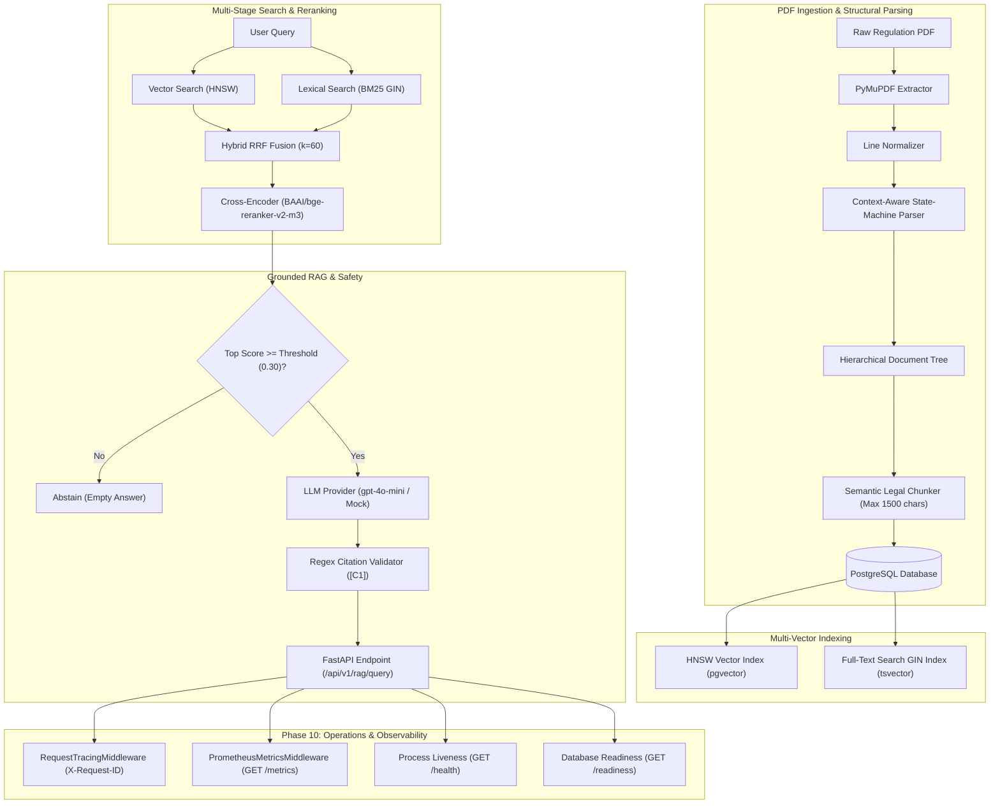

# FinReg Intelligence RAG: Enterprise Indonesian Financial Regulatory RAG Platform

**Language:** 🇬🇧 English · [🇮🇩 Bahasa Indonesia](README.id.md)

[](https://www.python.org/downloads/)
[](https://github.com/pgvector/pgvector)
[](https://fastapi.tiangolo.com/)
[](https://github.com/astral-sh/ruff)
[](Dockerfile)
[](LICENSE)

An enterprise-grade, production-oriented Retrieval-Augmented Generation (RAG) platform engineered specifically for complex Indonesian financial regulations issued by **Bank Indonesia (BI)** and the **Financial Services Authority (OJK)**.

The system combines **hierarchical legal state-machine parsing**, **hybrid HNSW vector + BM25 lexical search**, **neural cross-encoder reranking**, **grounded generation with strict citation validation**, and a **containerized, CI-validated operational foundation**.

---

## 🌟 Engineering Highlights

1. **Context-Aware State-Machine Structural Parser**:
   - Custom AST-style legal parser that processes complex Indonesian regulatory structures (`BAB`, `Pasal`, `Ayat`, `Huruf`, `Angka`) into explicit hierarchical trees without third-party LLM parsing latency.
2. **Multi-Stage Hybrid Search (RRF $k=60$)**:
   - Merges 1536-dimensional dense vector embeddings (`pgvector` HNSW index) and Indonesian BM25 full-text search (`tsvector` GIN index) via Reciprocal Rank Fusion, preserving exact legal article lookup and semantic paraphrases.
3. **Neural Cross-Encoder Reranking**:
   - Integrates `BAAI/bge-reranker-v2-m3` via HuggingFace CrossEncoder to score candidate precision before LLM context assembly.
4. **Deterministic Grounding & Abstention Safeguards**:
   - Replaces non-deterministic LLM-as-a-judge approaches with deterministic regex citation parsing (`[C1]`), token budgeting, context leak prevention, prompt injection defenses, legal conflict handling, and early score-threshold abstention.
5. **Production Operational & Container Foundation**:
   - Multi-stage non-root `Dockerfile` (`python:3.11-slim`, `appuser` UID 10001), multi-container `docker-compose.yml`, GitHub Actions CI workflow, Prometheus metrics (`GET /metrics`), request tracing (`X-Request-ID`), and backward-compatible process `/health` vs PostgreSQL database `/readiness` checks.
6. **Auditable Evaluation Benchmark**:
   - Custom evaluation engine supporting MRR@K, HitRate@K, graded nDCG@K, Precision/Recall, Citation Validity, and Abstention Accuracy with evaluation-layer canonical path normalization.

---

## 🏛 System Architecture & Data Flow



Detailed architecture diagrams, sequence flowcharts, and state machines are documented in [docs/architecture.md](docs/architecture.md).

---

## 📊 Phase 8 Empirical Evaluation Benchmark Results

The system includes a custom mathematical evaluation engine executed via `python -m finreg.evaluation.cli`.

> **Note on Test Environment & Capabilities**:
> - **Production Capabilities**: `OpenAIEmbeddingProvider` (`text-embedding-3-small`), `CrossEncoderRerankerProvider` (`BAAI/bge-reranker-v2-m3`), `OpenAILLMProvider` (`gpt-4o-mini`).
> - **Offline Benchmark Fallbacks**: `MockEmbeddingProvider` (deterministic hash-seeded pseudo-random vectors) and `MockLLMProvider` (offline test stub).

### Retrieval Stage Metrics (In-Domain Population: $N=2$)

| Metric | Stage 1: Dense Vector (Phase 4A) [Non-production Mock] | Stage 2: BM25 Lexical (Phase 4B) | Stage 3: Hybrid RRF (Phase 4C) | Stage 4: Hybrid + Neural Reranker (Phase 5) |
| :--- | :---: | :---: | :---: | :---: |
| **MRR@1 / HitRate@1** | 0.0000 | 0.5000 | 0.0000 | 0.5000 |
| **MRR@5 / HitRate@5** | 0.0000 | **0.5000** | 0.2500 | **0.5000** |
| **nDCG@5** | 0.0000 | **0.1687** | 0.1064 | **0.1687** |
| **Precision@5** | 0.0000 | **0.1000** | 0.1000 | **0.1000** |
| **Recall@5** | 0.0000 | **0.2500** | 0.2500 | **0.2500** |

### Phase 6 Generation & Safety Metrics ($N=3$)

| Metric Name | Score | Technical Analysis |
| :--- | :---: | :--- |
| **Citation Validity** | **100.00%** | 100% of generated citation tags strictly follow `[C1]` regex syntax |
| **Citation Precision** | **50.00%** | 50% of cited context blocks match target canonical legal evidence |
| **Citation Recall** | **25.00%** | 25% of target gold evidence provisions cited in generation |
| **Grounding Coverage** | **100.00%** | 100% of answer claims contain valid citations |
| **Gold Claim Coverage** | **0.00%** | LLM cited `Pasal 16` (p. 7) instead of target `Pasal 1` (p. 2) for Claim 1 |
| **Unsupported Claim Rate** | **0.00%** | Zero ungrounded claims generated |
| **Abstention Accuracy** | **100.00%** | 100% accurate abstention on out-of-domain queries |

Full benchmark breakdowns, canonical identity traces, and failure analysis are documented in [docs/eval-report.md](docs/eval-report.md).

---

## 🛠 Local Setup, Docker & Reproducibility

### 1. Requirements & Docker Compose Execution
```bash
# Clone Repository
git clone https://github.com/ilfijandrisno/finreg-intelligence-rag.git
cd finreg-intelligence-rag

# Start PostgreSQL 16 + pgvector & FastAPI Container Stack
docker compose up -d --build
```

### 2. Operational Probes & Metrics
```bash
# Check Liveness Probe (HTTP 200)
curl http://localhost:8000/health

# Check Database Readiness Probe (HTTP 200 / 503)
curl http://localhost:8000/readiness

# Scrape Prometheus Metrics (HTTP 200)
curl http://localhost:8000/metrics
```

### 3. Verify Code Quality & Offline Tests
```bash
# Run Pytest Suite inside Container (or local venv)
pytest

# Run Code Quality Checks
ruff check .
mypy src

# Execute Benchmark CLI
python -m finreg.evaluation.cli --dataset-path data/evaluation/benchmark_gold_dataset.json --output-dir data/evaluation/reports
```

---

## 📚 Documentation Index

- [Architecture & Data Flow](docs/architecture.md)
- [Database Schema & Data Model](docs/data-model.md)
- [Developer Setup & CLI Guide](docs/development.md)
- [Phase 10 Containerization & Deployment Readiness](docs/deployment-readiness.md) · [🇮🇩 ID](docs/deployment-readiness.id.md)
- [Evaluation Report & Failure Analysis](docs/eval-report.md) · [🇮🇩 ID](docs/eval-report.id.md)
- [ADR 001: Hybrid RRF Retrieval](docs/adr/001-hybrid-rrf-retrieval.md) · [🇮🇩 ID](docs/adr/001-hybrid-rrf-retrieval.id.md)
- [ADR 002: Deterministic Grounding & Abstention](docs/adr/002-deterministic-grounding.md) · [🇮🇩 ID](docs/adr/002-deterministic-grounding.id.md)
- [ADR 003: Canonical Identity Normalization](docs/adr/003-canonical-eval-identity.md) · [🇮🇩 ID](docs/adr/003-canonical-eval-identity.id.md)
- [Indonesian Version / Versi Bahasa Indonesia](README.id.md)

---

## 📄 License

Distributed under the MIT License. See [LICENSE](LICENSE) for details.
