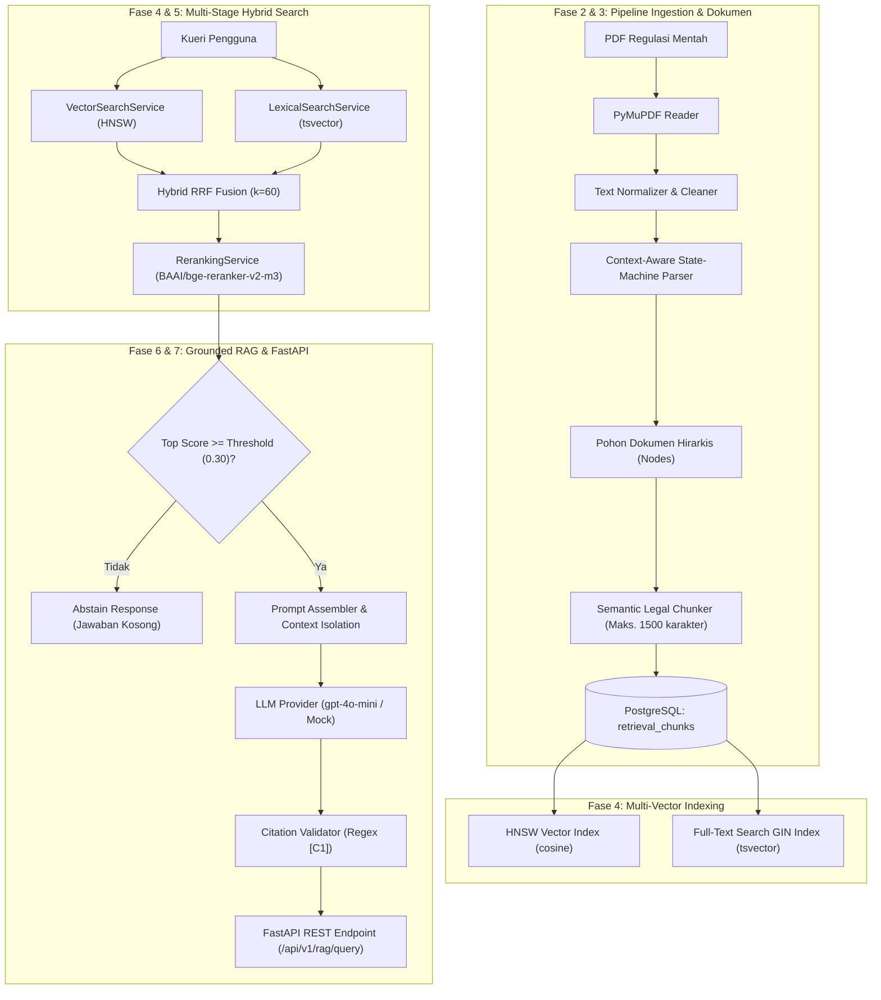
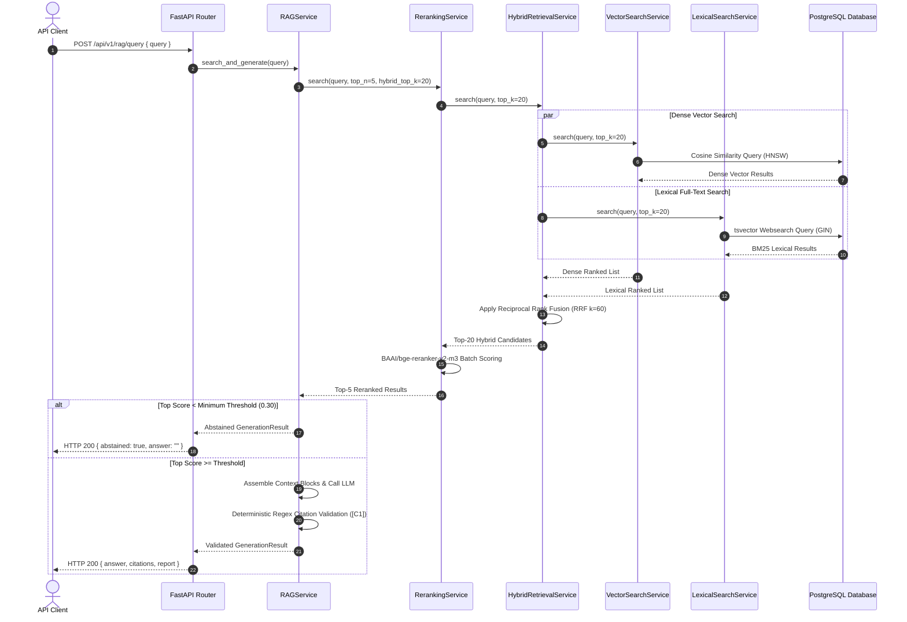
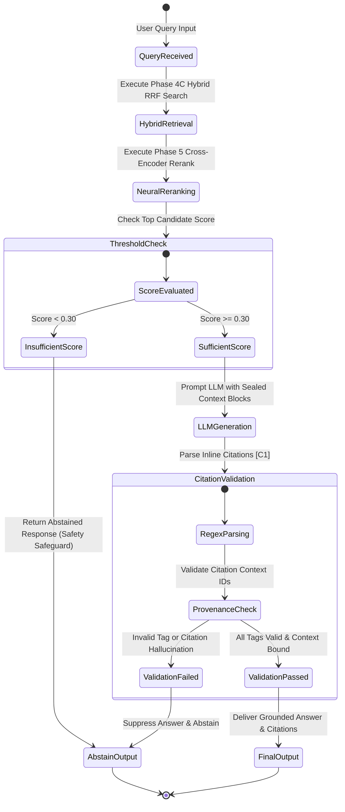

# FinReg Intelligence RAG: Arsitektur Sistem & Aliran Data

**Bahasa:** 🇮🇩 Bahasa Indonesia · [🇬🇧 English](architecture.md)

## 1. Ringkasan Sistem

FinReg Intelligence RAG adalah platform legal technology berorientasi produksi yang dirancang untuk ingestion otomatis, hybrid indexing, reranking, dan question answering berbasis grounding atas peraturan keuangan Indonesia yang diterbitkan oleh Bank Indonesia (BI) dan Otoritas Jasa Keuangan (OJK).

Platform ini menerapkan provenance hukum yang ketat, sitasi inline yang dapat diverifikasi, isolasi batas konteks, serta safeguards abstention eksplisit berbasis ambang skor.

---

## 2. Arsitektur Sistem End-to-End

---

## 3. Sequence Hybrid Retrieval Multi-Tahap & Reranking

---

## 4. State Machine Enforcement Grounded RAG Fase 6

---

## 5. Ringkasan Technology Stack

- **Bahasa Utama**: Python 3.11+
- **Ekstraksi PDF**: PyMuPDF (`fitz`)
- **Parser Engine**: Custom Regex Context-Aware State-Machine Parser
- **Database Layer**: PostgreSQL 16 + `pgvector`
- **Vector Search Index**: HNSW (`vector_cosine_ops`, $m=16, ef\_construction=64$)
- **Full-Text Index**: PostgreSQL `tsvector` GIN index (konfigurasi bahasa `indonesian`)
- **Neural Reranker**: `BAAI/bge-reranker-v2-m3` melalui HuggingFace `sentence-transformers` CrossEncoder
- **REST Framework**: FastAPI + Pydantic v2
- **Testing & Quality**: Pytest, Ruff, Mypy
