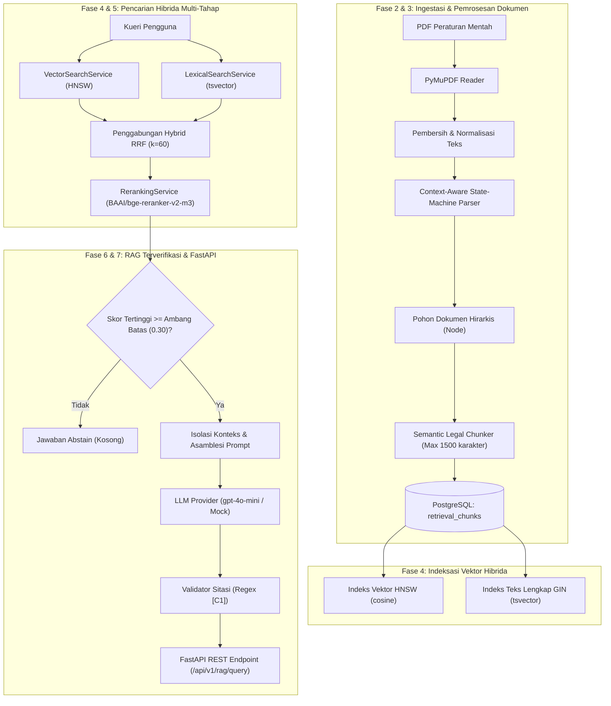

# FinReg Intelligence RAG: Arsitektur Sistem & Alur Data

## 1. Ringkasan Sistem

FinReg Intelligence RAG adalah platform legal technology tingkat produksi yang dirancang untuk otomasi ingestasi, indeksasi hibrida, reranking, dan pencarian jawaban berbasis bukti hukum (*grounded QA*) atas peraturan keuangan Indonesia yang diterbitkan oleh Bank Indonesia (BI) dan Otoritas Jasa Keuangan (OJK).

Platform ini menjamin provensi hukum yang ketat, sitasi inline yang terverifikasi, isolasi konteks, dan mekanisme *abstention* otomatis berbasis ambang batas skor.

---

## 2. Arsitektur Sistem End-to-End

---

## 3. Komponen Utama

- **Parser Struktur Hukum**: Parser berbasis *state-machine* kontekstual yang mengekstrak hirarki hukum (`BAB`, `Pasal`, `Ayat`, `Huruf`, `Angka`).
- **Pencarian Hibrida RRF**: Penggabungan HNSW vector search (`pgvector`) dan BM25 full-text search (`tsvector`) dengan Reciprocal Rank Fusion ($k=60$).
- **Neural Reranking**: Model Cross-Encoder (`BAAI/bge-reranker-v2-m3`) untuk pemeringkatan ulang berbasis presisi semantik.
- **RAG Terverifikasi & Abstention**: Evaluasi sitasi berbasis regex deterministik dan penghentian jawaban otomatis jika bukti tidak mencukupi.
