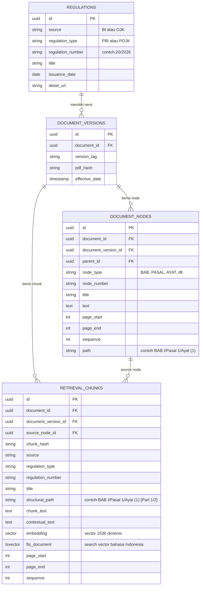

# FinReg Intelligence RAG: Skema Basis Data & Model Provenance Kanonikal

**Bahasa:** 🇮🇩 Bahasa Indonesia · [🇬🇧 English](data-model.md)

## 1. Ringkasan Skema Relasional (PostgreSQL + pgvector)

Skema basis data dirancang untuk mempertahankan metadata regulasi resmi, versioning dokumen, node pohon hukum hirarkis, dan chunk yang siap digunakan untuk retrieval.



---

## 2. Indeks Basis Data & Optimasi Performa

### Vector Search Index
- **Jenis Indeks**: HNSW (`vector_cosine_ops`)
- **Parameter**: `m = 16`, `ef_construction = 64`
- **Kolom Target**: `retrieval_chunks.embedding` (1536 dimensi)

### Lexical Full-Text Search Index
- **Jenis Indeks**: GIN Index
- **Kolom Target**: `retrieval_chunks.fts_document` (`tsvector` dengan konfigurasi `indonesian`)

### Relational & Composite B-Tree Indexes
- `idx_retrieval_chunks_doc_ver` (`document_id`, `document_version_id`)
- `idx_retrieval_chunks_reg_num` (`regulation_type`, `regulation_number`)

---

## 3. Skema Identitas Hukum Kanonikal

Untuk evaluasi benchmark dan verifikasi provenance hukum, setiap provision ground truth dan evidence chunk hasil retrieval diidentifikasi menggunakan **Canonical Identity 4-Tuple** yang deterministik:

$$\text{Canonical Key} = (document\_id, \text{normalize}(structural\_path), page\_start, page\_end)$$

### Normalisasi Suffix Structural Path
Selama perbandingan evaluasi, suffix yang ditambahkan oleh text splitter dihapus tanpa memodifikasi record database:

```python
# 'BAB I/Pasal 1/Ayat (1) [Part 1/2]' -> 'BAB I/Pasal 1/Ayat (1)'
normalized_path = re.sub(r"\s*\[Part\s+\d+/\d+\]$", "", raw_path)
```
