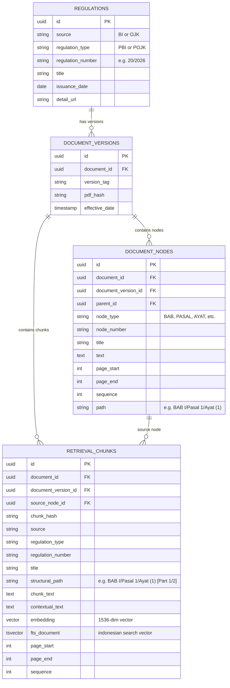

# FinReg Intelligence RAG: Database Schema & Canonical Provenance Model

**Language:** 🇬🇧 English · [🇮🇩 Bahasa Indonesia](data-model.id.md)

## 1. Relational Schema Overview (PostgreSQL + pgvector)

The database schema is structured to preserve official regulatory metadata, document versioning, hierarchical legal tree nodes, and retrieval-ready chunks.



---

## 2. Database Indexes & Performance Optimization

### Vector Search Index
- **Index Type**: HNSW (`vector_cosine_ops`)
- **Parameters**: `m = 16`, `ef_construction = 64`
- **Target Column**: `retrieval_chunks.embedding` (1536 dimensions)

### Lexical Full-Text Search Index
- **Index Type**: GIN Index
- **Target Column**: `retrieval_chunks.fts_document` (`tsvector` with `indonesian` configuration)

### Relational & Composite B-Tree Indexes
- `idx_retrieval_chunks_doc_ver` (`document_id`, `document_version_id`)
- `idx_retrieval_chunks_reg_num` (`regulation_type`, `regulation_number`)

---

## 3. Canonical Legal Identity Schema

For benchmark evaluation and legal provenance verification, every ground truth provision and retrieved evidence chunk is identified by a deterministic **Canonical Identity 4-Tuple**:

$$\text{Canonical Key} = (document\_id, \text{normalize}(structural\_path), page\_start, page\_end)$$

### Structural Path Suffix Normalization
During evaluation comparisons, text-splitter suffixes are stripped without mutating database records:

```python
# 'BAB I/Pasal 1/Ayat (1) [Part 1/2]' -> 'BAB I/Pasal 1/Ayat (1)'
normalized_path = re.sub(r"\s*\[Part\s+\d+/\d+\]$", "", raw_path)
```
